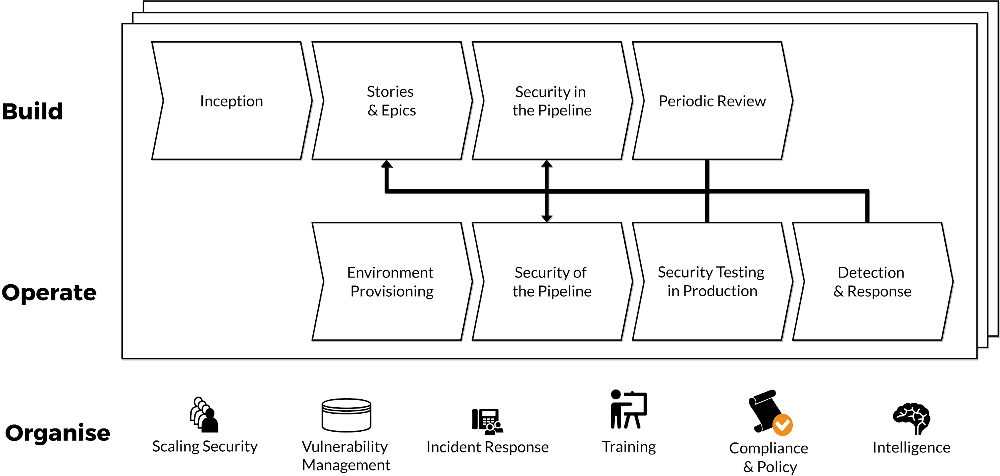

# The Advice Process Protocols

## The Advice Process Protocol

It’s important to understand where the Advice Process fits into different decision-making frameworks. This helps frame what it is, and also what it isn’t.

Because we talk about flat organisations and distributed decision-making, people often make misplaced assumptions about the AP, so hopefully this section will help to frame where the Advice Process sits in the overall picture.

### Different protocols for making decisions

The Advice Process is not about gaining consensus, consent or winning a popular vote to proceed with a given action. But it also differs from the traditional, top-down, ‘_I have a mandate_’ model that exists in most organisations today.

The messy reality of life is that people have things they prefer \(“I want apples”\), things they will tolerate \(“I could have any fruit”\) and things they object to \(“I won’t eat junk food”.\) On a basic level, this can be applied to the different decision-making protocols to highlight how these approaches are impacted by the group dynamics..

Below is an attempt to show how the different decision-making protocols align:

| Only me | Me and my mate | Group |
| :--- | :--- | :--- |
|  |  |  |

From: [London - Decentralised Decision Making - April 2019](https://docs.google.com/presentation/d/1coels2ur22VV9Hpmy02WTlYY-QIJ5rayWtv75hQYb8E/edit?usp=sharing)

### Outline of the Different Protocols

| **Decision protocol** | **How the decision is made** |
| :--- | :--- |
| Consensus | Seeks as much agreement as possible, so there is a general agreement around the proposal. Impact: your proposal moves to match that of the group despite your preference. |
|  |  |
| Consent | Seeks to remove objections or gain ‘permission’ on the proposal; “I’ll proceed if no one objects.” Impact: If you can’t remove objections to your proposal, then it fails to proceed. |
|  |  |
| Democratic | Seeks to bring a proposal to the point where a simple majority prefer or tolerate it. Impact: Your proposal moves to where you think you can gain sufficient support to proceed. |
|  |  |
| **Advice \(Process\)** | **Seeks input, establishes decision maker’s preference, decision then made based on that preference. Impact: Your decision aligns with what you think is the** _**best course of action for the proposal.**_ |
|  |  |
| Mandate | Decision made within the boundaries of decision maker’s role. “I’ll proceed if I prefer.” Impact: The proposal aligns with the decision maker’s preference, but often without testing the proposal. |
|  |  |

### Different Characteristics of the Different Protocols

In the ‘Benefits of the Advice Process’ section above, we identified four key aspects EE is looking for when making decisions. **Collaboration**, **Accountability**, **Transparency** and an opportunity for **Feedback and Learning.** Here’s how each of the protocols stacks up against those requirements – it’s fairly obvious why we chose the Advice Process.

|  | **Collaboration** | **Accountability** | **Transparency** | **Feedback & Learning** |
| :--- | :--- | :--- | :--- | :--- |
| **Consensus** | YES | NO | YES | ? |
| **Consent** | YES | NO | YES | ? |
| **Democratic** | YES | NO | YES | ? |
| **Advice \(Process\)** | YES | YES | YES | YES |
| **Mandate** | NO | YES | NO | ? |

#### Advice vs. Consensus, Consent & Democratic Protocols

As outlined in the table, the core difference between the Advice Process and Consensus, Consent & Democratic Protocols is the focus on **Accountability**. This is important, because when looking to drive an initiative though what are essentially voting systems, you end up getting the worst of all worlds:

* The initiative that the person is driving ceases to be their own, and turns into a watered-down set of compromises that no one can love or get passionate about.
* In the event of running the initiative, it becomes easy to shirk responsibility because the ideas are not fully the owners.

In contrast, with the Advice Process:

* The Decision Maker is clearly accountable for the outcome. They are under no obligation to implement the advice given \(only to listen with an open mind\), so it’s very clear where accountability and responsibility lie.
* People are motivated when they feel they have ownership of what’s happening. That ownership just doesn’t exist in the same way with a vote.
* People work hard to make the right decision when they are clearly accountable.

_“In the Advice Process when someone only gets to give advice, they know someone heard what they had to say. They made their case. They had a conversation. They didn’t just cast a ballot.”_[_\[1\]_](the-ap-protocol.md)

#### Advice vs. Mandate

Like the Advice Process, accountability is clear when using a Mandate protocol. However, it cannot offer anywhere near the same level of **collaboration** or **transparency**. With collaboration – including advice from experts and those motivated to contribute due to the impact on them – the quality of decision making will only increase. And with transparency, the decision-maker will be motivated to make the best decision possible, and be prepared to own it. For us at Equal Experts, it’s just not acceptable to do away with either of these aspects.

## The decentralisation of decision making \(pirate or navy?\)

The Advice Process brings additional benefits around decentralisation and genuine empowerment to make decisions. Usually, when people talk about decentralisation and empowerment, they mean delegating decisions to a lower level in a hierarchy; this is only part of the picture.

We can illustrate what we mean with the metaphor of a navy vs. pirates \(arrr!\).

A simplified decentralisation model would look at who makes the most important decisions \(and who can overrule the decisions made by others\):

EE sits more towards the Pirate end of this model, with highly agile teams allowing quick decision making. However, we should note the reality; the Navy won and the Golden Age of Pirates came to an end. So does that mean that highly centralised decision making beats highly decentralised?

**Pirate vs. Navy vs. Digital Pirate**

The big advantage that central command has is being able to create the big picture view that allows for better strategic decisions. Information flows from nodes into the central command, allowing a strategic picture to be created. Decisions made locally are small and can be overridden by central command.

Compare this to the pirate model, where bigger decisions are made at the point where information is generated. This creates the ability to respond in a highly agile way, but there’s limited ability to build up the big picture, because the information doesn’t flow around the network. No single node has the necessary context to create a quality strategy.

So, to create the best of both worlds, you need a highly connected ‘Digital Pirate’. Agility is maintained as decisions are made where the action is; however, the local nodes are highly connected and share information. This gives them access to the big picture context, which allows them to make high quality strategic decisions.

| **Independent, decentralised Decision Makers \(Pirate\)** | **Independent, decentralised Decision Makers, with highly connected decision information \(Digital Pirate\)** | **Centralised Decision Maker \(Navy\)** |
| :--- | :--- | :--- |

|  |  |  |
| :--- | :--- | :--- |

<table>
  <thead>
    <tr>
      <th style="text-align:left">
        <ul>
          <li>Highly agile</li>
          <li>Decisions made directly by those on the ground</li>
        </ul>
      </th>
      <th style="text-align:left">
        <ul>
          <li>Highly agile</li>
          <li>Decisions made directly by those on the ground</li>
          <li>Information network feed to the decision makers</li>
          <li>Decision makers have big picture awareness and context</li>
        </ul>
      </th>
      <th style="text-align:left">
        <ul>
          <li>Information network feed to the decision makers</li>
          <li>Decision makers have big picture awareness and context</li>
        </ul>
      </th>
    </tr>
  </thead>
  <tbody></tbody>
</table><table>
  <thead>
    <tr>
      <th style="text-align:left">
        <ul>
          <li>Decision makers lack big picture awareness</li>
          <li>Limited channels of information between Decision makers</li>
        </ul>
      </th>
      <th style="text-align:left">
        <ul>
          <li>HIgh effort communications channels between Decision Makers</li>
        </ul>
      </th>
      <th style="text-align:left">
        <ul>
          <li>Limited agility &amp; pace of local response</li>
          <li>Decisions made by indirect decision makers (those without local awareness)</li>
        </ul>
      </th>
    </tr>
  </thead>
  <tbody></tbody>
</table>This information flow must come from all directions – it’s not only the responsibility of “The Management”. Teams have an obligation to share information about their local context out to the wider organisation.

Once a high-quality information flow is in place, a second key take-way is that those higher up the hierarchy must enact trust in the local decision makers to use this information to make the right decision, locally. With all the information in the world, if central command doesn’t trust people to make decisions on behalf of the organisation, the decentralised model will revert to command and control.

To maintain information flow across the organisation take time and effort. It’s not something that just happens. If you want individuals or teams to operate autonomously then they must know what’s going on, context takes time to build and involves information that initially might not seem relevant, only to become so at a later date. From the start, then, try and operate in the open as much as possible, letting people know the bad news as well as the good. Start sharing stories and use tools that invite the free flow of information. Expecting teams to be autonomous and strategic is possible, but only with this added effort.

**Pro tips: measuring decentralisation and empowerment of decision making.**

At Equal Experts we hold a log of all APs published. This allows us to answer the following questions:

* In the past month, what percentage of the employed base have published an AP?
* In the past month, what is the total value / average value / count of AP for Leadership / Non-leadership roles?
* In the past 12 months how many AP decisions have been overturned by “Leadership”?

<table>
  <thead>
    <tr>
      <th style="text-align:left">
        
      </th>
      <th style="text-align:left">
        
If distribution of decisions is desired then:

        <ul>
          <li>APs created by non-leadership roles should have an &#x201C;average value&#x201D;
            that is tending towards that of leadership roles.</li>
          <li>Volume of APs created should bias towards non-leadership roles over time.</li>
        </ul>
      </th>
    </tr>
  </thead>
  <tbody></tbody>
</table>